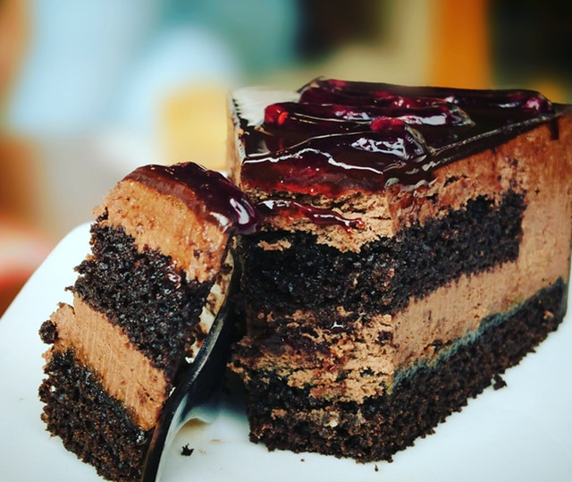

## Programação Concorrente

A programação concorrente permite que possamos identificar num programa trechos de códigos independentes, os quais poderiam executar em qualquer ordem. Isso permite, por exemplo, que consigamos executar o programa mais rapidamente processando estes trechos independentes simultaneamente. Essa aceleração costuma ser diminuída quando estes trechos precisam compartilhar algum recurso. 

Na cozinha, um exemplo de concorrência acontece no preparo da massa, recheio e cobertura de um bolo. Como serão combinados em algum momento, é importante que sejam iniciados em momentos independentes para que não haja espera na combinação. Nesta situação, um retardo pode ocorrer quando diferentes partes do preparo compartilham um mesmo recurso, como uma batedeira. No momento em que uma parte do preparo precisa utilizar a batedeira, esta não pode estar sendo utilizada por outra parte. Nesta situação, a parte que necessitou por último deverá aguardar até a primeira terminar. Essa espera pode atrasar o momento em que as partes serão combinadas. No caso da batedeira, para evitar o risco de se misturar ingredientes de partes distintas, uma parte da receita precisa terminar por completo seu uso para que outra possa iniciar. Se o utensílio a ser compartilhado é uma faca elétrica, é possível que as partes da receita não precisem encerrar o uso deste utensílio por completo, ou seja, o uso pode ser trocado entre as partes ao longo do preparo. Outra possibilidade de compartilhamento ocorre quando as partes podem compartilhar recursos sem interrupção. Por exemplo, um relógio pode ser usado para controlar a realização de partes do preparo simultaneamente. Esta forma é mais interessante porque não impõe retardo em nenhuma das partes.
