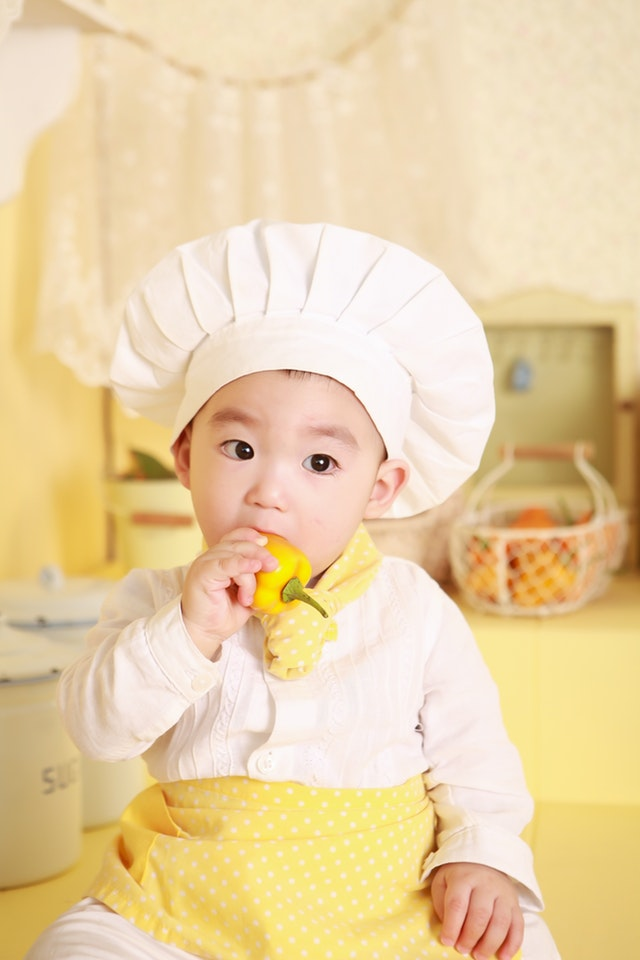

## Programação Móvel

Programar para dispositivos móveis é como cozinhar para crianças. A essência é a mesma, mas com algumas restrições. Por exemplo, pratos infantis normalmente não levam álcool ou alimentos muito gordurosos no preparo. Os organismos das crianças, principalmente as bem pequenas, ainda estão em fase de crescimento e não conseguem digerir grandes quantidades de alimentos. Além disso, os pratos das crianças costumam ser decorados de forma a serem atraentes para o público alvo.

Para quem cozinha e precisa atender os 2 públicos (adulto e infantil, ou seja, desktop e móvel, respectivamente), essa distinção tende a atrapalhar, pois é mais fácil cozinhar um mesmo prato para 2 pessoas do que 2 pratos distintos. Isso se dá porque receitas diferentes usualmente requerem ingredientes diferentes, utensílios diferentes e ainda tem tempo de preparo diferenciado. Quanto a decoração dos pratos infantis, a analogia na programação móvel é a elaboração da interface, pois as telas são menores e os aplicativos precisam ter interfaces simples e intuitivas.

