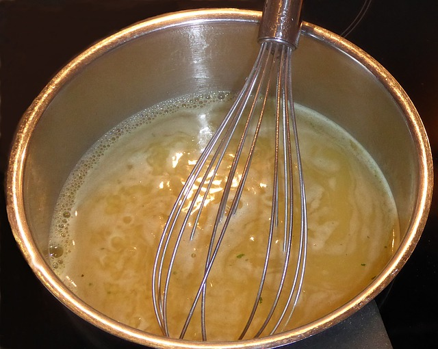

## Abstraction

In computer programming, we use abstraction when we desire to simplify the description of a complex scenario. In the recipe, abstraction is used when a single step requires a lot of small steps to be concluded. For instance, in a milk pudding recipe, I found: "Prepare a light caramel with sugar.". This step may be described as heating the sugar and mixing until it gets a pasty consistency. So, the chef who wrote the recipe abstracted the complexity of the step. This mechanism is important for shortening the size of programs and recipes.
