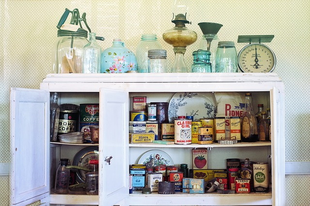

## Files 

Files can be seen as food that is already prepared, semi-prepared, or even crude. It can be used in many different ways. It can be stored for later use. It can be combined to create a new one. Such features allow a long preparation to be reused instantly. In the introduction, we saw that refrigerators, food pantries, and freezers are the secondary memories. In these memories, we store files to be used later for other recipes.
