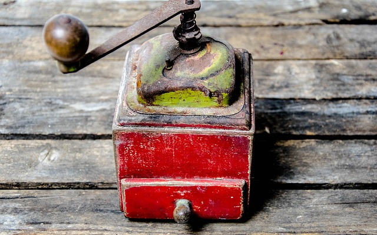

## Libraries

When we prepare a recipe, kitchen utensils like **mixers**, **blenders**, and **multiprocessors** may be used. We use them to speed up preparation. These utensils are stored in kitchen cabinets and put on stands when they are required to be used. As the space on a stand (main memory) is limited, a cook assistant must manage these utensils, moving them from and to the kitchen cabinets, in order to not overload the stand. In computer programming, we can relate it to libraries, which are tools that simplify the creation of programs. For instance, if our program needs to do some math operations, we could use a library for doing that. The same thing may happen when we need to do some complex step during a recipe preparation, like mixing some food. We could do it by hand, but using a mixer, we can complete the task faster.
