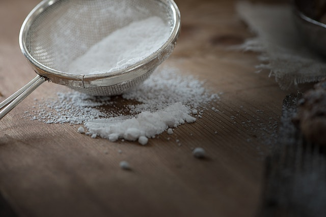

## Type conversion - Casting

This operation allows the value of a given type (an ingredient) to be converted into another one. For instance, when a real number is assigned to an integer, just the integral part is assigned. In the kitchen, when we wash some rice, a bowl contains the rice and the water. When we pass this content through a strainer, we get the rice, removing the dirt as a result. There are many more situations where this conversion happens in the kitchen: when peeling some food, when creating cubes of rice after its preparation, when making ornaments after food preparation, etc.

In the kitchen, we could have:

~~~~~~~~
bowl <- sifted flour 

mug <- strained passion fruit juice 
~~~~~~~~

So, in all situations, the food is the same. It was just adapted to be used in a particular way.