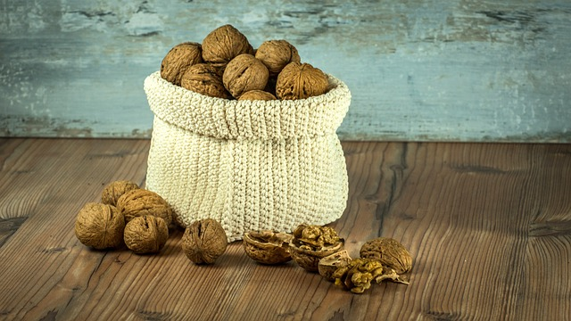

## Collections

Collections are bags, pockets, or any other stuff to store ingredients. This storage may last for the preparation of a recipe or for a longer time. When stored for a longer time, they can be put in kitchen cabinets or fridges to save space. In order to be easily recovered, ingredients may be stored following an order, like the expiration date or the size. In computer programming, the same happens.
