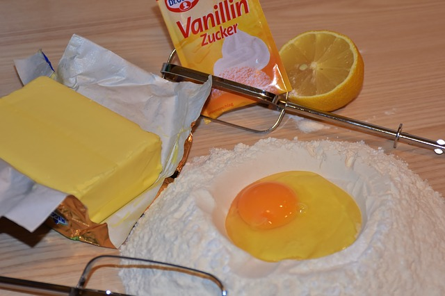

## Control Flow

In computer programming, control flow commands are operations used to modify the order of execution of commands in a program. This flexibility allows the construction of more powerful computer programs since many tasks can be performed using the same program. In the kitchen, similar operations are required when cooking meat, for instance. We have to check from time to time whether we desire rare, medium, or well-done meat. Repetitive task of checking the meat could be expressed by a single operation that repeats until the desired state is reached, regardless of the time it takes.

In the kitchen, we could have:

~~~~~~~~
    Mix until a syrup is made.
~~~~~~~~

or

~~~~~~~~
    While the consistency is liquid 
        Mix
~~~~~~~~

In these examples, the mixing operation runs until a situation occurs. 
