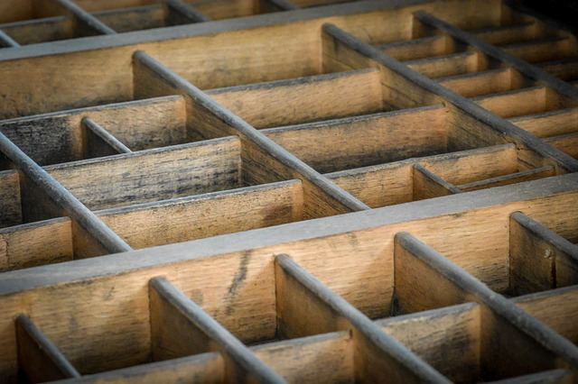

## Data Structures

In the kitchen, organizers are useful for easing the task of storing and recovering ingredients and kitchen utensils. In computer programming, it is the same. A classic example is database software, which is a program that facilitates the task of storing and recovering data for any other software. In the kitchen, organization is required in a stand, but also in kitchen cabinets. Again, computing is the same since data can be stored and recovered, such as in the main memory or on hard drives. As data, ingredients, and so on have specific features, like size and shape, in the kitchen and in computer programming, there are many types of organizers to suit each kind of data or ingredient.
