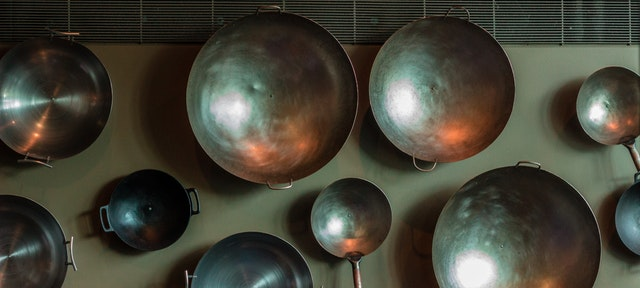

## Identifiers

~~~~~~~~
Metaphor:

Identifiers: Named utensils
~~~~~~~~

In computer programming, everything may have a name, which is a shortcut for finding such things. In the kitchen, when we regard a pot as small, medium, or big, we are assigning it a kind of name. If we have a lot of them, we must use any other feature, like the colour, whether it is old or new. This task of locating a particular utensil could be precise if we assigned a distinct name to each utensil. And why should it be precise? Because when we prepare a recipe, ingredients are precisely combined. As they are probably stored in kitchen utensils, we must combine them in the way the recipe defines them. That's why kitchen utensils must be precisely defined. The same happens in computer programming.
