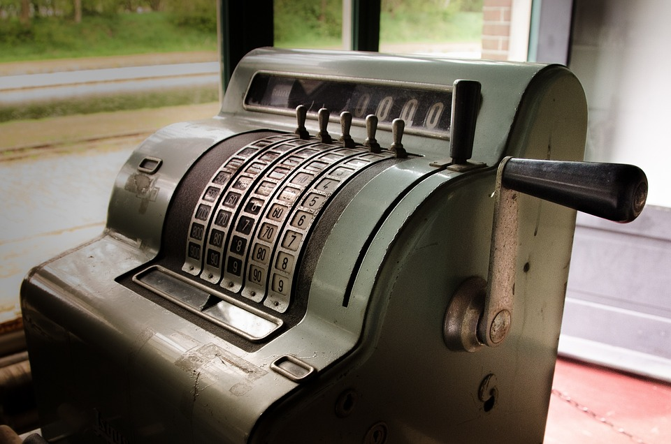

## Pointers

In a restaurant, tables are usually numbered. These numbers are useful for registering everything that clients order. Then, the client can be charged correctly when leaving the restaurant. Afterwards, the order list must be erased. Otherwise, a new client will pay more than he consumes.

In computer programming, **pointers** are addresses (values, numbers) used to point out areas where values are stored. These areas may be statically or dynamically allocated, i.e., allocated before or during program execution. In static allocation, we reserve a space that will last the whole execution of the program. In the kitchen, for instance, we could reserve a table for the owner of the restaurant. It will be allocated all the time. In dynamic allocation, we do not know how many areas a program will require. We also do not know how many clients a restaurant will serve on a given day. A programmer, or the owner of the restaurant, may choose and combine the types of allocation that best suit your needs.

In restaurants, tables may be available in different rooms. Some of these rooms may stay open or closed depending on the number of clients. Also, tables have a limited number of seats. When we have a group of clients larger than this limit, tables can be put together in order to accommodate everyone. For that, the tables' numbers must also be combined. These arrangements are common in restaurants, but also in computers memories.

**Garbage collector** is a concept quite important in computer programming and related to dynamic memory allocation. Imagine we live in a corrupt country where clients eventually leave restaurants without paying. This may cause many undesirable states: 1) The table may stay busy without any clients; 2) new clients will have to wait for a fake overload of people in the restaurant. In order to avoid these problems, we could adopt an automatic charging system. Whenever a client enters the restaurant, his credit card is read and associated with a table's number. When the client leaves the restaurant, orders assigned to his table are charged, and the table is made available to new clients. In computer programming, this corrupt behaviour occurs frequently. So, this mechanism is used a lot during program execution.
