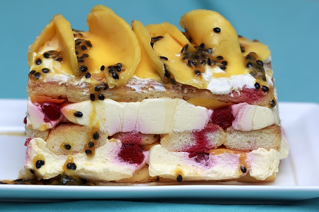

## Recursão

Imagine we want to prepare gelatin. We need to follow a sequence of steps in order to prepare the recipe. If you've never prepared one, it's quite simple. First, we mix some powdered gelatin with a portion of hot water. Then, we add some cold water and put it into the fridge or freeze it to toughen up.

Imagine we want to prepare a gelatin cake. For instance, this cake must have five layers of gelatin with different flavours and colors. What we have to do is repeat the process above five times. Of course, we can prepare a cake with three or ten layers since the process is the same. In computer programming, this is called recursion. We repeat (recur) one routine as many times as we want to prepare a recipe.
