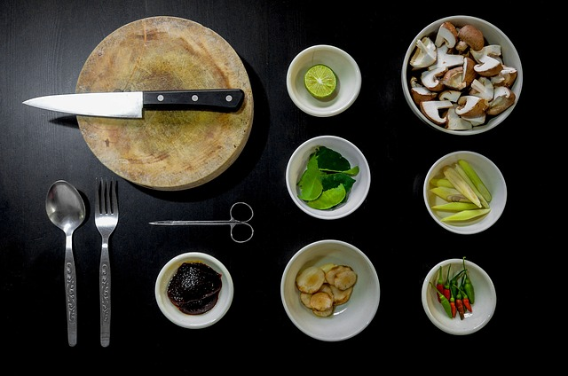

## Records

When we prepare a recipe, we need to locate the required ingredients. When those ingredients are organized, we can find and use them faster. We use kitchen utensils for organization. In computer programming, this job is done by records, which can be used to store values in different formats.

