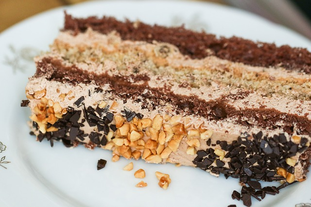

## Subroutines 

When we have a recipe with a lot of steps, those steps are usually grouped into small processes. Each process can be seen as a mini-recipe, which has its own ingredients, kitchen utensils, and steps. For instance, when we prepare a cake, we can divide the recipe into three processes: the dough, the top, and the filling of the cake. In computer programming, these processes are called routines, subroutines, procedures, or functions of a program. Such division is important for flexibility and organization. For instance, we can replace the filling cake without having to analyze the whole recipe since we just have to look at the filling cake subroutine. Besides, we can more easily reuse a process from one recipe into other recipes. For instance, use a chocolate cake top to cover a milk pudding.
