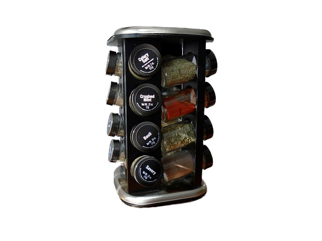

## Vectors

Spice containers are used to store spices in an orderly manner. Such organization is important to locate a spice whenever it is needed. Containers usually have a space for identifying which spice is stored. In computer programming, a spice container can be seen as a collection. A collection is a data structure that is used for story values. The identification is an index. It can be a name (string) or a number (integer number). When there´s not enough space to store a name, a number can be used. In computer programming, a vector is a collection indexed by numbers. A map is a collection indexed by names or more complex values. 